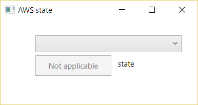
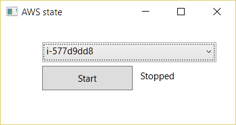
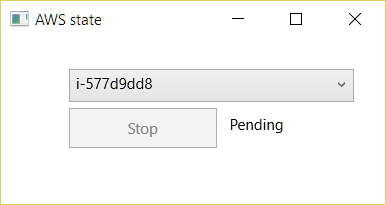

# AWS-instance-state-controller
Shows list of available AWS EC2 instances, can start/stop instances

<table>

<tr>

<td>

</td>

<td>

</td>

</tr>
<tr>

<td>

</td>

<td>

</td>

</tr>

</table>
